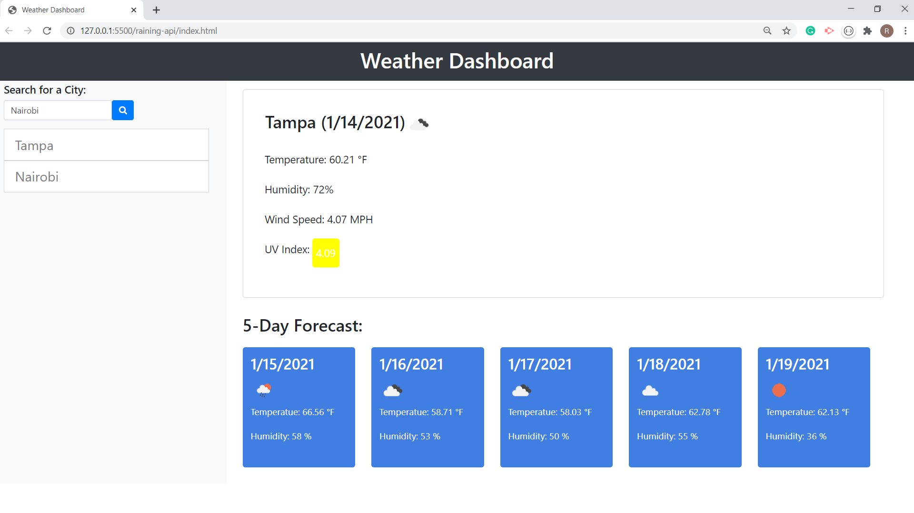

# raining-api
Raining API is a weather app designed to get the current and future weather information of a specific city. When the user searches for a city, its current weather information is displayed on top of the forecast information. The city is then saved into local storage for easy access. When a city button is pressed, its information is displayed. When the page is reloaded, previous search history is displayed.

<a href="https://rryanwilsonw.github.io/raining-api/">Link To Website<a>
  

